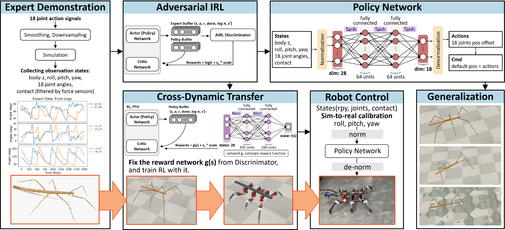

# AIRL-Insect-Walking

This repository implements a data-driven framework for learning bio-inspired locomotion strategies from stick insect walking using Adversarial Inverse Reinforcement Learning (AIRL).

This repository provides a complete data-driven learning and transfer framework, which integrates:
- Expert trajectory generation in CoppeliaSim
- Adversarial reward learning (AIRL)
- Policy learning generalization
- Cross-dynamic evaluation
- ROS2-based sim-to-real calibration and deployment

The goal is to bridge biology and engineering through a data-driven framework that learns transferable locomotion strategies from biological walking data.

<!-- This work has been submitted to  -->

<!-- Parts of this work will be presented at the:
- **SICE 38th Decentralized Autonomous Systems Symposium, DAS (第38回 自律分散システム・シンポジウム)**.   -->

A related journal publication will come soon.


## Project Structure
```bash
airl-insect-walking/
├── algorithms/               # modules of airl/ppo etc.
├── common/               # base modules and CoppeliaSim environment interfaces 
├── env/               # CoppeliaSim main scripts
├── env_legloss/               # CoppeliaSim main scripts for leg loss scenarios
├── evaluation/               # evaluation records
├── expert/               # expert demonstrations
├── logs/               # training logs
├── networks/               # modules for building Actor, Critic, Discriminator neural networks
├── ros2_ws/               # ros2 interfaces and logs
├── .gitignore
├── environment.yml
├── eval_plot.ipynb               # plots the evaluation results of foot trajectories etc. (part of the trail)
├── eval_plot.py               # plots the evaluation results of body pose, velocity and gaits etc. (the whole trail)
├── expert.py               # load the expert demonstration (add contact columns, create a symmetric action bounds)
├── gait_analysis.ipynb               # plots the duty factor, phase difference, synchronization matrix etc. (part of the trail)
├── intra-limb analysis.ipynb               # plots the cyclograms etc. (part of the trail)
├── README.md
├── test_airl.py               # tests a trained AIRL/PPO Actor model in a CoppeliaSim environment
├── train_airl.py               # trains an AIRL agent in a CoppeliaSim environment using expert demonstrations
└── train_ppo.py               # trains a PPO agent in a CoppeliaSim environment
```

## Installation

1. Install CoppeliaSim v4.10.0
2. Enable ZMQ remote API
3. Navigate to the project root directory, and create conda environment:

```bash
cd airl-insect-walking
conda env export > environment.yml
conda activate coppeliasim
```

## Quick Start
#### 1. Start CoppeliaSim (in a new terminal)

```bash
conda activate coppeliasim
cd /path/to/CoppeliaSim
./coppeliaSim
```
load the created scene `medauroidea_stick_insect.ttt` in CoppeliaSim.

#### 2. Run the AIRL Training Code (in another terminal)

```bash
conda activate coppeliasim
cd airl-insect-walking
python train_airl.py
```

## Experiments

This project includes five main experimental directions:

---
### 1. Expert Demonstration Generation

Expert demonstration are generated in CoppeliaSim based on the real stick insect, *Medauroidea extradentata*, walking trajectories. The demonstrations include:
- States: body-z, rpy, joint positions, and binary foot contact information;
- Actions: joint commands. 

Note: Demonstration generation is done with the CoppeliaSim UI with a defined `main_script.py` in folder `env/` or `env_legloss/`. The`expert.py` module provides the data preparation of the complete expert demonstration for the AIRL training. It is integrated in the `trian_airl.py`, thus no need to run it separately.

---
### 2. AIRL Learning from Expert Demonstrations

Adversarial Inverse Reinforcement Learning (AIRL) is applied to infer the underlying reward structure and the policy from expert data. The Discriminator learns to distinguish expert trajectories from policy-generated ones, while the policy is optimized using the recovered reward.

- **Run the AIRL training code:**
```bash
python train_airl.py
```

- **Test the trained Actor (policy) network:**
```
python test_airl.py
```

- **Evaluation:**
Use `eval_plot.py`, `eval_plot.ipynb`, `gait_analysis.ipynb`, and `intra_limb analysis.ipynb` for quantitative analysis.

Note: Import the required `normalized_env` module and change the parameters based on the different tasks and needs.

---
### 3. Policy Learning Generalization

The proposed AIRL-based learning framework is evaluated for the policy learning generalization ability with very limited expert demonstration data. With the demonstration dataset of a healthy stick insect walking on a flat terrain, the framework can learn the policy and reward function for:
- uneven terrain `env/`,
- RM leg loss scenarios `env_legloss/`.

Note: Import the required `normalized_env` module and change the parameters based on the different tasks and needs.

---
### 4. Cross-Dynamic Transfer

The AIRL-learned reward network (Discriminator g(s) network) is tested for the cross-dynamic transfer task. The reward network is learned from the Stick Insect agent in the CoppeliaSim environment and used to transfer PPO learning to the RedMirror agent in the CoppeliaSim environment. These two agents differ in joint locations, joint properties, torque ranges, and body weight, etc.

- **Transfer group**: using `AIRL-learned reward network + reward shaping factor` as reward function.
```bash
python train_ppo.py # import ppo_transfer module
```
- **Control group**: using only `reward shaping factor` as reward function.
```bash
python train_ppo.py # import ppo_dependent module
```

Note: Import the required `ppo` module and `normalized_env` module, and change the parameters based on the different tasks and needs.

---
### 5. Sim-to-Real Calibration

A sim-to-real calibration procedure on the orientation (rpy) is implemented to bridge the gap between the simulation *RedMirror* agent and the physical hexapod robot *RedMirror*.

The workflow consists of three stages:

- **ROS2 workspace setup**

Build the ROS2 workspace:
```bash
conda deactivate
cd airl-insect-walking/ros2_ws
colcon build
source install/setup.bash
```

Grant serial port permissions:
```bash
sudo chmod 777 /dev/ttyU2D2
sudo chmod 777 /dev/ttyESP32
```

- **Running the Real Robot Pipeline**

Terminal 1 – Robot Hardware Drivers
```bash
ros2 run red_mirror_pkg red_mirror_dynamixel_node
ros2 run red_mirror_pkg red_mirror_esp32_node
```

Terminal 2 – Policy Node
```bash
export PYTHONPATH=$PYTHONPATH:/home/yuchen/airl-insect-walking
ros2 run robot_policy policy_node
```

- **Monitoring and Debugging**

Check topic connections:

```bash
ros2 topic list
ros2 topic info /position_controller/commands
```

Echo important topics:

```bash
ros2 topic echo /joint_states
ros2 topic echo /position_controller/commands
ros2 topic echo /red_mirror/DXL_cur_positions
ros2 topic echo /red_mirror/foot_contact
ros2 topic echo /red_mirror/imu
```

Record rosbag data:

```bash
ros2 bag record -a
cd /path/to/saved_rosbag
python3 extract_rosbag.py
```

Visualize node graph:

```bash
rqt_graph
```

Evaluate the test trail:
Use `sim2real_check.ipynb` in the saved rosbag folder for analysis.

## Citation

If you use this repository in your research or find it helpful for your research or project, please cite:

```bibtex
# coming soon
```